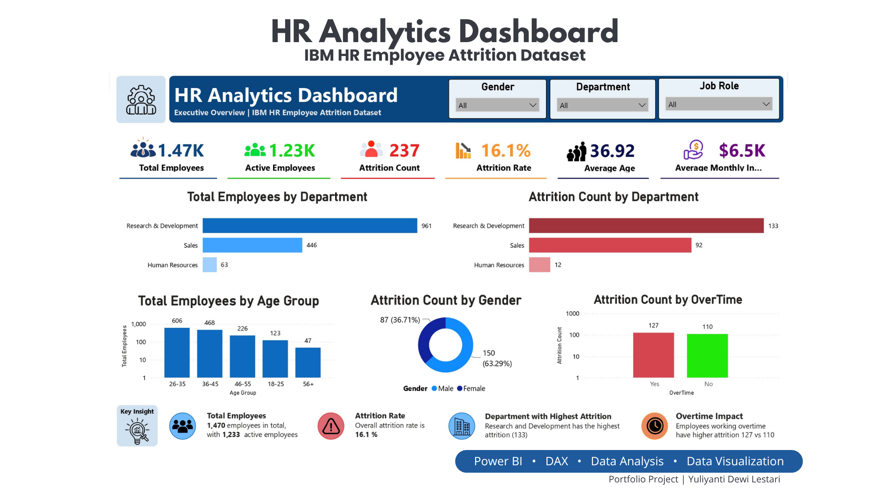
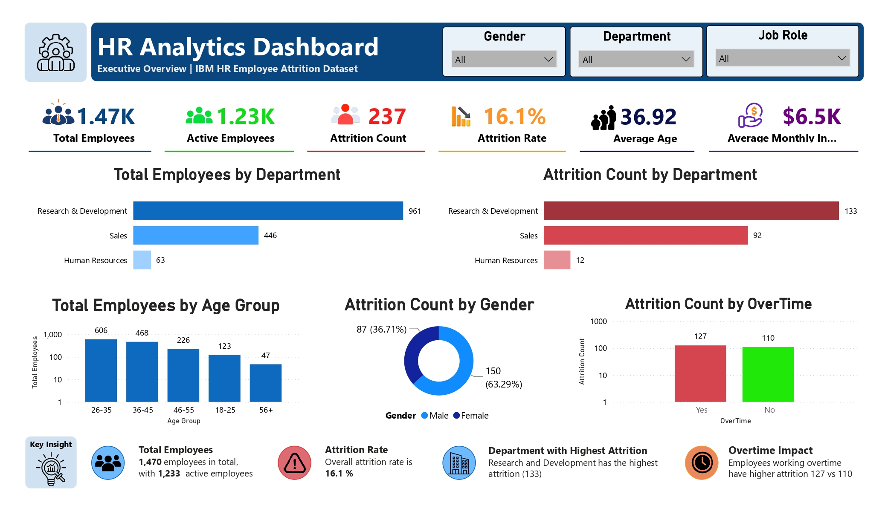
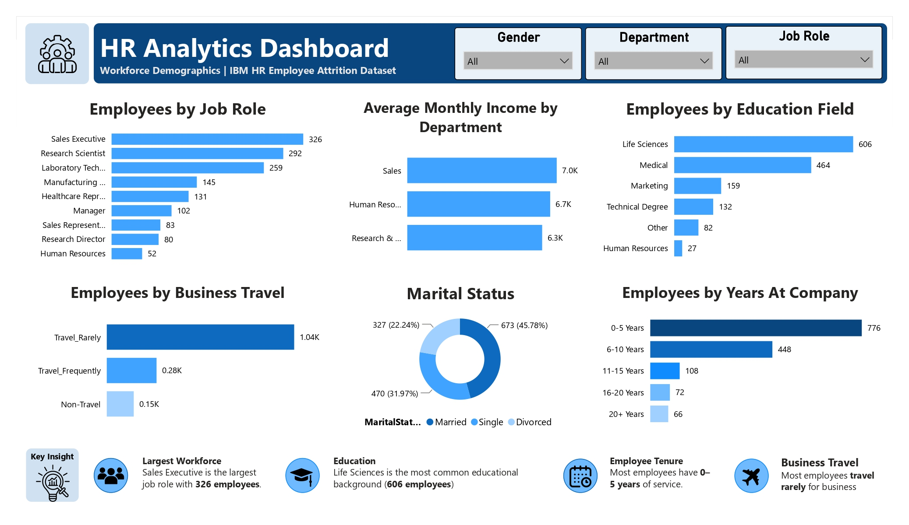
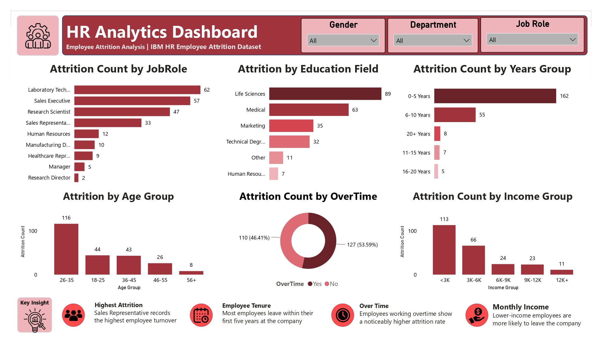

# HR Analytics Dashboard

Interactive HR Analytics Dashboard built with **Power BI** to analyze employee demographics, workforce distribution, and employee attrition trends using the **IBM HR Employee Attrition Dataset**.

---

## Dashboard Cover



---

# Project Objectives

This project aims to:

- Analyze employee demographics and workforce composition.
- Monitor employee attrition across departments.
- Identify workforce trends using interactive dashboards.
- Support HR decision-making with data-driven insights.

---

# Dataset

**Dataset:** IBM HR Employee Attrition Dataset

The dataset contains employee information including:

- Demographics
- Department
- Job Role
- Monthly Income
- Education
- Business Travel
- Overtime
- Attrition Status

---

# Tools & Technologies

- Microsoft Power BI
- Power Query
- DAX
- Data Modeling
- Data Visualization

---

# Dashboard Pages

## Page 1 — Executive Overview



### Key Highlights

- Total Employees
- Active Employees
- Attrition Rate
- Department Overview
- Age Distribution
- Overtime Analysis

---

## Page 2 — Workforce Demographics



### Key Highlights

- Job Role Distribution
- Education Field
- Business Travel
- Marital Status
- Years at Company
- Average Monthly Income

---

## Page 3 — Employee Attrition Analysis



### Key Highlights

- Attrition by Job Role
- Attrition by Education
- Attrition by Income
- Attrition by Overtime
- Attrition by Age Group
- Employee Tenure

---

# Key Insights

- Research & Development has the largest workforce.
- Overall employee attrition rate is **16.1%**.
- Employees working overtime have a noticeably higher attrition rate.
- Employees aged **26–35** represent the largest workforce.
- Most employees leaving the company have **0–5 years** of service.
- Lower-income employees are more likely to leave the company.

---

# Business Recommendations

- Improve employee retention within the Research & Development department.
- Monitor overtime to reduce employee turnover.
- Strengthen onboarding and career development during employees' first five years.
- Develop employee engagement initiatives for younger employees.
- Use dashboard insights to support strategic workforce planning.

---

# Repository Structure

```text
powerbi-hr-analytics-dashboard
│
├── README.md
├── HR-Analytics-Dashboard.pbix
├── HR-Analytics-Dashboard.pdf
├── IBM-HR-Employee-Attrition.csv
├── cover.png
├── page1.jpg
├── page2.jpg
└── page3.jpg
```

---

# Author

**Yuliyanti Dewi Lestari**

Fresh Graduate in Mathematics passionate about **Data Analytics**, **Business Intelligence**, and **Data Visualization**.

Built as part of my Data Analytics Portfolio.
